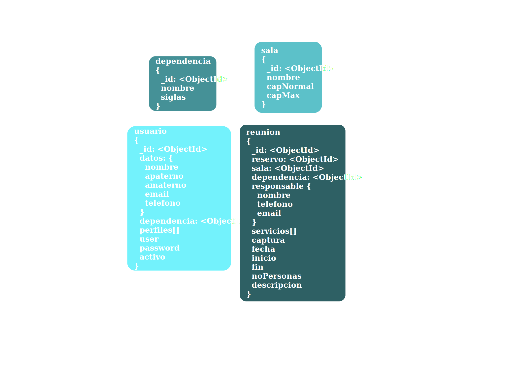
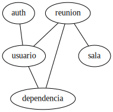

# Administración de Salas

Este es un sistema basado en microservicios para la administración de salas para reuniones.

## Perfiles de usuario

* Administrador
    * Alta/Baja\* de usuarios.
    * Activación/Desactivación de usuarios.
    * Asignación de perfiles.
    * Alta/Baja\* de salas.
    * Activación/Desactivación de salas.
    * Alta/Baja\* de dependencias.
    * Activación/Desactivación de dependencias.

* Supervisor
    * Alta/Baja/Cambio de reuniones(también externas).

* Solicitante
    * Alta/Baja/Cambio de reuniones(48hrs hábiles antes de la reunión).

* Observador
    * Consulta de reuniones.

* Analista
    * Consulta de reporte de reuniones.

## Base de datos

### Esquema



## Microservicios



## Seguridad

### Token

Se usará `jwt` como motor para generar tokens.

* Payload:

```
{
    "iat": 1371720939,
    "exp": 1371720939,
    "id": "507f1f77bcf86cd799439011",
    "datos": {
	"nombre": "Ricardo",
	"apaterno": "Martínez",
	"amaterno": "Sanchez",
	"email": "ricardo@example.com"
    },
    "perfiles": ["Administrador", "Supervisor", "Solicitante", "Observador", "Analista"],
    "user": "rmartinez",
    "activo": true
}
```

La variable de entorno JWT_KEY contiene la llave para decodificar.

```
$ docker run -p 80:8080 -e JWT_KEY=secret dependencia_server
```
